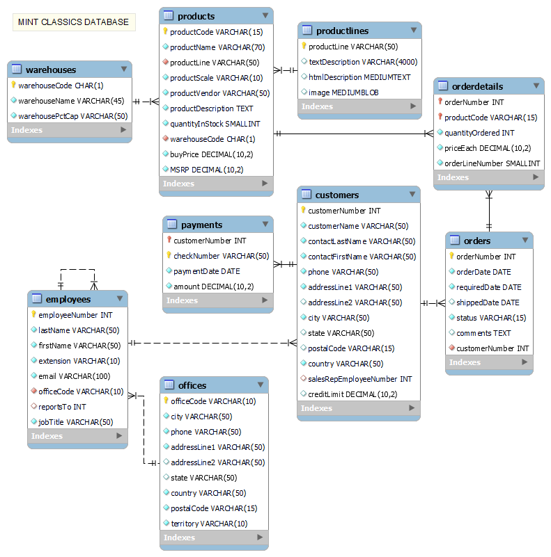

# Coursera SQL Project: Analyze Data in a Model Car Database
## Mint Classics Company 

This project is part of my journey to enhance my data analytics skills through Coursera. It is a hands-on SQL-based project where I analyze inventory data for the fictional Mint Classics Company, a retailer of classic cars and vehicles. The goal is to support inventory-related business decisions, focusing on stock optimization and the closure of a storage facility.

# Work Process

## Step 1: Database Setup

The first step was to download the [`mintclassicsDB.sql`](./mintclassicsDB.sql) file, which contains the script for creating and populating the Mint Classics relational database. Using the **"Import from Self-Contained File"** option in MySQL Workbench, I imported the script, which created a nine-table relational database.


The following EER diagram illustrates the structure of the Mint Classics database, which served as a reference for my analysis:



## Step 2: Explore the Tables

In this step, I explored the various tables within the Mint Classics database to gather insights. Click the arrow below to expand and view the details of each table.

<details>
<summary>Expand to see Customers Table</summary>

### Customers Table Description

The `customers` table contains essential information about customers of the Mint Classics Company. Below is a description of each column in the table:

| Column Name               | Data Type       | Description                                                                                      |
|--------------------------|-----------------|--------------------------------------------------------------------------------------------------|
| `customerNumber`         | int             | Unique identifier for each customer (Primary Key).                                             |
| `customerName`           | varchar(50)     | Name of the customer or business.                                                               |
| `contactLastName`        | varchar(50)     | Last name of the primary contact person for the customer.                                       |
| `contactFirstName`       | varchar(50)     | First name of the primary contact person for the customer.                                      |
| `phone`                  | varchar(50)     | Phone number of the customer or their primary contact.                                         |
| `addressLine1`           | varchar(50)     | Primary address of the customer (e.g., street address).                                        |
| `addressLine2`           | varchar(50)     | Additional address details (optional).                                                          |
| `city`                   | varchar(50)     | City where the customer resides.                                                                 |
| `state`                  | varchar(50)     | State or province where the customer is located (optional).                                    |
| `postalCode`             | varchar(15)     | Postal code of the customer's address.                                                           |
| `country`                | varchar(50)     | Country of the customer.                                                                          |
| `salesRepEmployeeNumber` | int             | Employee number of the sales representative assigned to the customer (Foreign Key).             |
| `creditLimit`            | decimal(10,2)   | Credit limit assigned to the customer.                                                            |

</details>

<details>
<summary>Expand to see Employees Table</summary>

### Employees Table Description

The `employees` table contains information about the employees who manage customer relationships and sales within the Mint Classics Company. Below is a description of each column in the table:

| Column Name             | Data Type       | Description                                                                                      |
|-------------------------|-----------------|--------------------------------------------------------------------------------------------------|
| `employeeNumber`        | int             | Unique identifier for each employee (Primary Key).                                             |
| `lastName`              | varchar(50)     | Last name of the employee.                                                                       |
| `firstName`             | varchar(50)     | First name of the employee.                                                                      |
| `extension`             | varchar(10)     | Phone extension for the employee.                                                                |
| `email`                 | varchar(100)    | Email address of the employee.                                                                   |
| `officeCode`            | varchar(10)     | Identifier for the office where the employee works (Foreign Key).                               |
| `reportsTo`             | int             | Identifier of the employee's manager (Foreign Key).                                             |
| `jobTitle`              | varchar(50)     | Job title of the employee.                                                                        |

</details>

<details>
<summary>Expand to see Offices Table</summary>

### Offices Table Description

The `offices` table contains information about the various office locations of the Mint Classics Company. Below is a description of each column in the table:

| Column Name        | Data Type       | Description                                                                                      |
|--------------------|-----------------|--------------------------------------------------------------------------------------------------|
| `officeCode`       | varchar(10)     | Unique identifier for each office (Primary Key).                                              |
| `city`             | varchar(50)     | City where the office is located.                                                               |
| `phone`            | varchar(50)     | Phone number for the office.                                                                     |
| `addressLine1`     | varchar(50)     | Primary address of the office (e.g., street address).                                           |
| `addressLine2`     | varchar(50)     | Additional address details (optional).                                                           |
| `state`            | varchar(50)     | State or province where the office is located (optional).                                      |
| `country`          | varchar(50)     | Country where the office is located.                                                             |
| `postalCode`       | varchar(15)     | Postal code of the office's address.                                                             |
| `territory`        | varchar(10)     | Identifier for the sales territory associated with the office.                                   |

</details>

<details>
<summary>Expand to see Order Details Table</summary>

### Order Details Table Description

The `orderdetails` table contains information about the individual products included in each order placed by customers. Below is a description of each column in the table:

| Column Name          | Data Type       | Description                                                                                      |
|----------------------|-----------------|--------------------------------------------------------------------------------------------------|
| `orderNumber`        | int             | Unique identifier for each order (Foreign Key).                                               |
| `productCode`        | varchar(15)     | Unique identifier for each product (Foreign Key).                                              |
| `quantityOrdered`    | int             | Number of units of the product ordered.                                                         |
| `priceEach`          | decimal(10,2)   | Price per unit of the product at the time of the order.                                        |
| `orderLineNumber`    | smallint        | Line item number for the product in the order, used to differentiate between multiple products in a single order. |

</details>

<details>
<summary>Expand to see Orders Table</summary>

### Orders Table Description

The `orders` table contains information about customer orders placed with the Mint Classics Company. Below is a description of each column in the table:

| Column Name       | Data Type       | Description                                                                                      |
|-------------------|-----------------|--------------------------------------------------------------------------------------------------|
| `orderNumber`     | int             | Unique identifier for each order (Primary Key).                                               |
| `orderDate`       | date            | Date when the order was placed.                                                                |
| `requiredDate`    | date            | Date by which the customer requires the order to be delivered.                                  |
| `shippedDate`     | date            | Date when the order was shipped (optional).                                                    |
| `status`          | varchar(15)     | Current status of the order (e.g., Shipped, Cancelled, etc.).                                 |
| `comments`        | text            | Additional comments or notes related to the order.                                             |
| `customerNumber`   | int             | Unique identifier for the customer placing the order (Foreign Key).                            |

</details>

<details>
<summary>Expand to see Payments Table</summary>

### Payments Table Description

The `payments` table contains information about the payments made by customers for their orders at the Mint Classics Company. Below is a description of each column in the table:

| Column Name          | Data Type       | Description                                                                                      |
|----------------------|-----------------|--------------------------------------------------------------------------------------------------|
| `customerNumber`     | int             | Unique identifier for each customer (Foreign Key).                                             |
| `checkNumber`        | varchar(50)     | Unique identifier for the payment (e.g., check number).                                        |
| `paymentDate`        | date            | Date when the payment was made.                                                                  |
| `amount`             | decimal(10,2)   | Amount of money paid by the customer.                                                            |

</details>

<details>
<summary>Expand to see Product Lines Table</summary>

### Product Lines Table Description

The `productlines` table contains information about the different categories of products offered by the Mint Classics Company. Below is a description of each column in the table:

| Column Name        | Data Type       | Description                                                                                      |
|--------------------|-----------------|--------------------------------------------------------------------------------------------------|
| `productLine`      | varchar(50)     | Unique identifier for each product line (Primary Key).                                         |
| `textDescription`  | varchar(4000)   | Textual description of the product line (optional).                                            |
| `htmlDescription`  | mediumtext      | HTML formatted description of the product line.                                                |
| `image`            | mediumblob      | Binary data for an image representing the product line.                                        |

</details>

<details>
<summary>Expand to see Products Table</summary>

### Products Table Description

The `products` table contains information about the various products offered by the Mint Classics Company. Below is a description of each column in the table:

| Column Name          | Data Type       | Description                                                                                      |
|----------------------|-----------------|--------------------------------------------------------------------------------------------------|
| `productCode`        | varchar(15)     | Unique identifier for each product (Primary Key).                                              |
| `productName`        | varchar(70)     | Name of the product.                                                                             |
| `productLine`        | varchar(50)     | Identifier for the product line to which the product belongs (Foreign Key).                     |
| `productScale`       | varchar(10)     | Scale of the product (e.g., 1:10, 1:12, etc.).                                                |
| `productVendor`      | varchar(50)     | Name of the vendor supplying the product.                                                       |
| `productDescription`  | text            | Detailed description of the product.                                                             |
| `quantityInStock`    | smallint        | Number of units available in stock.                                                             |
| `warehouseCode`      | char(1)         | Identifier for the warehouse where the product is stored (Foreign Key).                         |
| `buyPrice`           | decimal(10,2)   | Purchase price of the product.                                                                   |
| `MSRP`               | decimal(10,2)   | Manufacturer's suggested retail price for the product.                                          |

</details>

<details>
<summary>Expand to see Warehouses Table</summary>

### Warehouses Table Description

The `warehouses` table contains information about the storage facilities used by the Mint Classics Company. Below is a description of each column in the table:

| Column Name           | Data Type       | Description                                                                                      |
|-----------------------|-----------------|--------------------------------------------------------------------------------------------------|
| `warehouseCode`       | char(1)         | Unique identifier for each warehouse (Primary Key).                                            |
| `warehouseName`       | varchar(45)     | Name of the warehouse.                                                                           |
| `warehousePctCap`     | varchar(50)     | Percentage capacity of the warehouse, indicating how full the warehouse is.                     |

</details>

## Step 3: Data Understanding

- ### Warehouse and Inventory Distribution

In this project, it was essential to analyze how the inventory of Mint Company was organized and distributed. One of the key questions we aimed to explore was:

1. **Where are the items stored, and if they were reorganized, could a warehouse be eliminated?**

To address this, we first needed to understand:

- How many warehouses were in operation.
- Which product lines were stored in each warehouse.

One of the analyses we performed was to understand the relationship between warehouses and product lines. The following SQL query was used to retrieve the data:

```sql
SELECT 
    w.warehouseName as "Warehouse",
    p.productLine as "Product Line"
FROM 
    products p
JOIN 
    warehouses w ON p.warehouseCode = w.warehouseCode
GROUP BY 
    w.warehouseName, p.productLine
ORDER BY 
    w.warehouseName, p.productLine;
```

| Warehouse | Product Line        |
|-----------|---------------------|
| East      | Classic Cars        |
| North     | Motorcycles         |
| North     | Planes              |
| South     | Ships               |
| South     | Trains              |
| South     | Trucks and Buses    |
| West      | Vintage Cars        |


We observed that there are four warehouses and seven product lines distributed across them. The **South Warehouse** holds the most product lines.

Now, we want to understand the **inventory quantity** across all warehouses, as well as analyze the **average product size**.

The following SQL query retrieves the total quantity of inventory:

```sql
SELECT 
    'Total' AS "Warehouse",
    SUM(quantityInStock) AS "Total Quantity"
FROM 
    products;
```

| Warehouse | Total Quantity |
|-----------|----------------|
| Total     | 555,131        |

```sql
SELECT w.warehouseName as Warehouse, 
       SUM(p.quantityInStock) AS "Current Stock", 
       w.warehousePctCap as "Warehouse Capacity (%)", 
       ROUND((SUM(p.quantityInStock) * 100.0) / w.warehousePctCap) AS "Max Capacity",
       ROUND((SUM(p.quantityInStock) * 100.0) / w.warehousePctCap) - SUM(p.quantityInStock) AS "Available Space",
       CONCAT('1:', MIN(CAST(SUBSTRING_INDEX(p.productScale, ':', -1) AS UNSIGNED))) AS minScale,
       CONCAT('1:', MAX(CAST(SUBSTRING_INDEX(p.productScale, ':', -1) AS UNSIGNED))) AS maxScale
FROM products p
JOIN warehouses w ON p.warehouseCode = w.warehouseCode
GROUP BY w.warehouseName, w.warehousePctCap;
```

| Warehouse | Current Stock | Warehouse Capacity (%) | Max Capacity | Available Space | Min Scale | Max Scale |
|-----------|---------------|------------------------|--------------|------------------|-----------|-----------|
| East      | 219,183       | 67                     | 327,139      | 107,956          | 1:10      | 1:24      |
| North     | 131,688       | 72                     | 182,900      | 51,212           | 1:10      | 1:700     |
| West      | 124,880       | 50                     | 249,760      | 124,880          | 1:18      | 1:50      |
| South     | 79,380        | 75                     | 105,840      | 26,460           | 1:12      | 1:700     |

From our analysis, we found that the total number of products in stock is **555,131**. The **East Warehouse** holds the highest number of products; however, the warehouses in the **North** and **South** accommodate larger-scale products.

In response to the initial question, we determined that we could indeed reduce one of the warehouses, considering the available capacity in the other locations. Therefore, it is also important to take into account the scale of the products. Additionally, understanding the distribution by product line will help us reorganize the inventory more effectively.

```sql

SELECT 
    w.warehouseName,
    p.productLine,
    SUM(p.quantityInStock) AS totalQuantity,
    CONCAT('1:', MIN(CAST(SUBSTRING_INDEX(p.productScale, ':', -1) AS UNSIGNED))) AS minScale,
	CONCAT('1:', MAX(CAST(SUBSTRING_INDEX(p.productScale, ':', -1) AS UNSIGNED))) AS maxScale
FROM 
    products p
JOIN 
    warehouses w ON p.warehouseCode = w.warehouseCode
GROUP BY 
    w.warehouseName, p.productLine
ORDER BY 
    w.warehouseName, p.productLine;
```
| Warehouse  | Product Line       | Total Quantity | Min Scale | Max Scale |
|------------|--------------------|----------------|-----------|-----------|
| East       | Classic Cars       | 219,183        | 1:10      | 1:24      |
| North      | Motorcycles        | 69,401         | 1:10      | 1:50      |
| North      | Planes             | 62,287         | 1:18      | 1:700     |
| South      | Ships              | 26,833         | 1:18      | 1:700     |
| South      | Trains             | 16,696         | 1:18      | 1:50      |
| South      | Trucks and Buses   | 35,851         | 1:12      | 1:50      |
| West       | Vintage Cars       | 124,880        | 1:18      | 1:50      |

#### *Proposal for Warehouse Optimization*

Considering the points discussed, I would propose the dissolution of the **South Warehouse**, with the following product line reallocations:
- The **Ships** product line will be moved to the **North Warehouse**, as it already accommodates products of equal scale.
- The **Trains** and **Trucks and Buses** product lines will be moved to the **West Warehouse**.

The new distribution would be as follows:

| Warehouse  | Warehouse % Capacity | Current Stock | Max Capacity | Available Space | Min Scale | Max Scale |
|------------|----------------------|---------------|--------------|------------------|-----------|-----------|
| East       | 67                   | 219,183       | 327,139      | 107,956          | 01:10     | 01:24     |
| North      | 87                   | 158,521       | 182,900      | 24,379           | 01:10     | 1:700     |
| West       | 71                   | 177,427       | 249,760      | 72,333           | 01:18     | 01:50     |


- ### Analysis of Inventory Numbers and Sales Figures

In this analysis, we aim to understand how inventory counts relate to sales figures. Specifically, we will investigate whether current inventory levels are adequate for demand and identify any discrepancies where order quantities exceed stock levels. This leads us to the second question proposed:

2. *How are inventory numbers related to sales figures? Do the inventory counts seem appropriate for each item?*

In the following section, I aimed to answer several key questions regarding the products in the database:

- How many different product types exist?
- Which products are the most expensive in stock?
- What are the most sought-after products in terms of stock?
- How do orders align with the available stock?

To begin, I investigated the number of distinct product models in the database using the following query:

```sql
SELECT COUNT(DISTINCT productCode) AS "Number of Models"
FROM mintclassics.products;
```
| Number of Models |
|--------------|
| 110            | 


From this query, I discovered that there are **110 different product models** in the system.

Next, I examined the stock levels to determine which products had the highest and lowest quantity in stock:

```sql
SELECT 
    productCode, 
    productName, 
    quantityInStock
FROM 
    mintclassics.products
ORDER BY 
    quantityInStock DESC
LIMIT 1;
```

| Product Code | Product Name       | Quantity In Stock |
|--------------|--------------------|-------------------|
| S12_2823     | 2002 Suzuki XREO    | 9997              |
| ...     | ...    | ...               |
| S24_2000     | 1960 BSA Gold Star DBD34    | 15                |


From this query, I observed that the product with the largest stock is the 2002 Suzuki XREO, with 9,997 units available. Conversely, the product with the smallest stock is the 1960 BSA Gold Star DBD34, with only 15 units remaining.

I then wanted to understand the products' value based on their unit prices. Using the following query, I identified the most expensive and cheapest products by their purchase price:

```sql
SELECT 
    productName, 
    buyPrice 
FROM 
    mintclassics.products
ORDER BY 
    buyPrice DESC 
LIMIT 1;
```
| Product Name                        | Buy Price |
|-------------------------------------|-----------|
| 1962 LanciaA Delta 16V              | 103.42    |
| ... | ...     |
| 1958 Chevy Corvette Limited Edition | 15.91     |

The result showed that the most expensive product by unit price is the **1962 Lancia Delta 16V, with a unit purchase price of 103.42**. On the other hand, the cheapest product is the **1958 Chevy Corvette Limited Edition**, with a unit price of 15.91.

To gain further insights, I calculated the total value of the products in stock by multiplying their unit prices by the number of units available. The query used for this is:
```sql
SELECT 
    productName, 
    buyPrice, 
    quantityInStock, 
    (buyPrice * quantityInStock) AS totalValue
FROM 
    mintclassics.products
ORDER BY 
    totalValue DESC
LIMIT 5;
```
| Product Name                       | Buy Price | Quantity In Stock | Total Value   |
|------------------------------------|-----------|-------------------|---------------|
| 1995 Honda Civic                   | 93.89     | 9772              | 917493.08     |
| 1952 Alpine Renault 1300           | 98.58     | 7305              | 720126.90     |
| 1962 LanciaA Delta 16V             | 103.42    | 6791              | 702325.22     |
| 1968 Dodge Charger                  | 75.16     | 9123              | 685684.68     |
| 1976 Ford Gran Torino               | 73.49     | 9127              | 670743.23     |


This revealed that, although the **1995 Honda Civic** is not the most expensive product by unit price, it **has the highest accumulated stock value** due to the large quantity available. This insight is crucial for inventory management, as it indicates which product holds the most financial weight in stock.

After reviewing the stock, I turned my attention to the orders, aiming to understand which product was the most requested both in terms of units and in terms of popularity across different customers.

```sql
SELECT p.productCode, p.productName, 
    COUNT(od.productCode) AS totalOrders,
    COUNT(DISTINCT o.customerNumber) AS totalCustomers 
FROM orderdetails od
JOIN products p ON od.productCode = p.productCode
JOIN orders o ON od.orderNumber = o.orderNumber
GROUP BY p.productCode, p.productName
ORDER BY totalOrders DESC
LIMIT 3;
```

| productCode | productName                         | totalOrders | totalCustomers |
|-------------|-------------------------------------|-------------|----------------|
| S18_3232    | 1992 Ferrari 360 Spider red         | 53          | 40             |
| S10_1678    | 1969 Harley Davidson Ultimate Chopper | 28        | 26             |
| S10_1949    | 1952 Alpine Renault 1300            | 28          | 27             |
| ...         | ...                                 | ...         | ...            |
| S18_4933    | 1957 Ford Thunderbird               | 24          | 20             |

```sql
SELECT p.productCode, p.productName, SUM(od.quantityOrdered) AS totalQuantityOrdered
FROM orderdetails od
JOIN products p ON od.productCode = p.productCode
GROUP BY p.productCode, p.productName
ORDER BY totalQuantityOrdered desc
LIMIT 3;
```

| productCode | productName                         | totalQuantityOrdered |
|-------------|-------------------------------------|----------------------|
| S18_3232    | 1992 Ferrari 360 Spider red         | 1808                 |
| S18_1342    | 1937 Lincoln Berline                | 1111                 |
| S700_4002   | American Airlines: MD-11S           | 1085                 |
| ...         | ...                                 | ...                  |
| S18_4933    | 1957 Ford Thunderbird               | 767                  |

From the data, we can observe that the **1992 Ferrari 360 Spider** was the most ordered product, with *53 total orders* placed by **40 different customers**, demonstrating its popularity across a wide customer base. This model **also had the highest number of units ordered**, with a total of 1,808 units. On the other hand, the **1957 Ford Thunderbird** had the fewest units ordered, with only **767 units**.

It is also important to identify any product that did not receive any orders and has remained in stock.

```sql
SELECT p.productCode, p.productName
FROM products p
LEFT JOIN orderdetails od ON p.productCode = od.productCode
WHERE od.productCode IS NULL;
```

| productCode | productName           |
|-------------|-----------------------|
| S18_3233    | 1985 Toyota Supra     |

As seen in the data, the **1985 Toyota Supra** *did not register any orders*, indicating it remains unsold in our stock.

At this stage, it's important to gain a better understanding of our orders. One key point is determining whether the current stock can meet the quantities ordered.

```sql
SELECT p.productName AS "Product Name", 
       SUM(od.quantityOrdered) AS "Quantity Ordered",
       p.quantityInStock AS "Available Stock",
       CASE 
           WHEN p.quantityInStock - SUM(od.quantityOrdered) < 0 THEN 'Not enough Stock'
           ELSE 'OK'
       END AS "Status"
FROM mintclassics.orderdetails od
JOIN mintclassics.products p ON od.productCode = p.productCode
GROUP BY p.productCode, p.productName, p.quantityInStock;
```
| Product Name                               | Quantity Ordered | Available Stock | Situation         |
|--------------------------------------------|------------------|-----------------|-------------------|
| 1968 Ford Mustang                          | 933              | 68              | Not enough Stock  |
| 1911 Ford Town Car                         | 832              | 540             | Not enough Stock  |
| 1928 Mercedes-Benz SSK                     | 880              | 548             | Not enough Stock  |
| 1960 BSA Gold Star DBD34                   | 1015             | 15              | Not enough Stock  |
| 1997 BMW F650 ST                           | 1014             | 178             | Not enough Stock  |
| 1996 Peterbilt 379 Stake Bed with Outrigger | 988              | 814             | Not enough Stock  |
| 1928 Ford Phaeton Deluxe                   | 972              | 136             | Not enough Stock  |
| 2002 Yamaha YZR M1                         | 992              | 600             | Not enough Stock  |
| The Mayflower                              | 898              | 737             | Not enough Stock  |
| F/A 18 Hornet 1/72                         | 1047             | 551             | Not enough Stock  |
| Pont Yacht                                 | 958              | 414             | Not enough Stock  |


From this, we can conclude that there are 11 products with insufficient stock to fulfill the registered orders.

Before examining our customers and collaborators, let’s look at the profit generated from these orders. 

```sql
SELECT 
    p.productName AS "Product Name",                              
    SUM(od.quantityOrdered * od.priceEach) AS revenue, 
    (SUM(od.quantityOrdered * od.priceEach) - SUM(od.quantityOrdered * p.buyPrice)) AS profit,
    ROUND(( (SUM(od.quantityOrdered * od.priceEach) - SUM(od.quantityOrdered * p.buyPrice)) / SUM(od.quantityOrdered * od.priceEach) ) * 100) AS profit_margin
FROM orderdetails od                             
JOIN products p ON od.productCode = p.productCode            
GROUP BY p.productCode, p.productName, p.buyPrice                
ORDER BY profit DESC
LIMIT 10;
```
| Product Name                               | Revenue      | Profit        | Profit Margin (%) |
|--------------------------------------------|--------------|---------------|--------------------|
| 1992 Ferrari 360 Spider red                | 276839.98    | 135996.78     | 49                 |
| 1952 Alpine Renault 1300                  | 190017.96    | 95282.58      | 50                 |
| 2001 Ferrari Enzo                          | 190755.86    | 93349.65      | 49                 |
| 2003 Harley-Davidson Eagle Drag Bike       | 170686.00    | 81031.30      | 47                 |
| 1968 Ford Mustang                          | 161531.48    | 72579.26      | 45                 |
| 1969 Ford Falcon                           | 152543.02    | 72399.77      | 47                 |
| 1928 Mercedes-Benz SSK                     | 132275.98    | 68423.18      | 52                 |
| 2002 Suzuki XREO                           | 135767.03    | 67641.47      | 50                 |
| 1980s Black Hawk Helicopter                | 144959.91    | 64599.11      | 45                 |
| 1948 Porsche Type 356 Roadster             | 121653.46    | 62725.78      | 52                 |
|...					     | ... 	    | ... 	    | ... 		 |
| 1939 Chevrolet Deluxe Coupe 		     | 28052.94     | 6904.85       | 25		 |


The **1992 Ferrari 360 Spider red** is the most profitable product, generating a *profit of 135,996.78* with a **profit margin of 49%**. Its high revenue potential makes it a key focus for sales strategies.

Interestingly, Both the **1968 Ford Mustang** and **1928 Mercedes-Benz SSK** stand out due to high demand but face stock shortages. The **Ford Mustang** has **933 units ordered** but only **68 available** in stock, while the **Mercedes-Benz SSK** has **880 units ordered** with only **548 available**. This deficit compromises potential profits and could impact customer satisfaction if not resolved. 
At the lower end of profitability, the **1939 Chevrolet Deluxe Coupe** generated the **least profit**, with *6,904.85* in profit and a **profit margin of 25%**. This may indicate an opportunity to either improve marketing, reduce costs, or focus efforts on more profitable models.
The high demand coupled with low available stock for various products indicates a need for improved inventory management strategies to capitalize on high-margin products.

